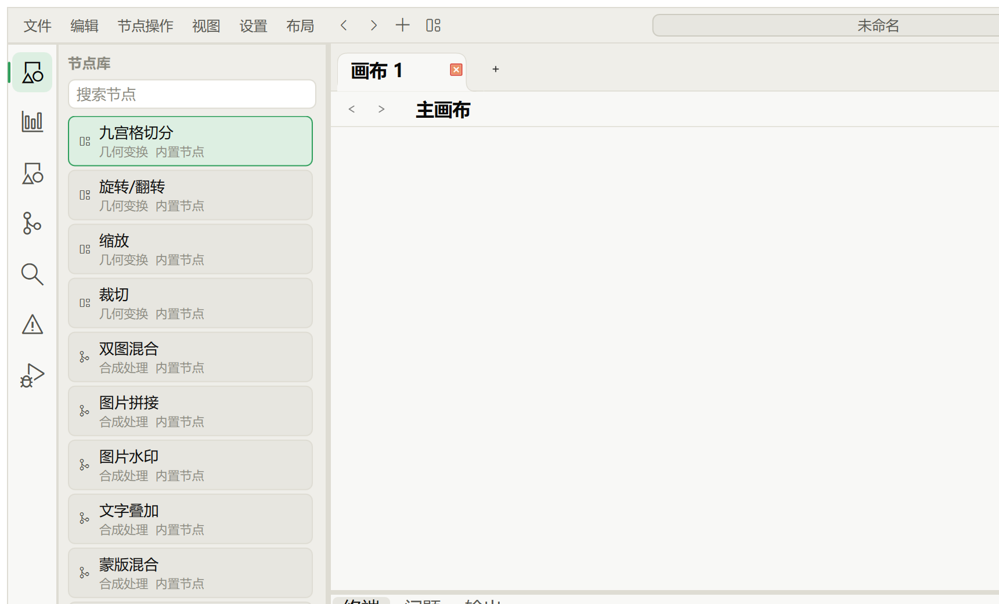
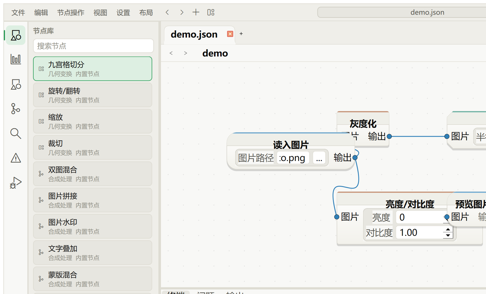
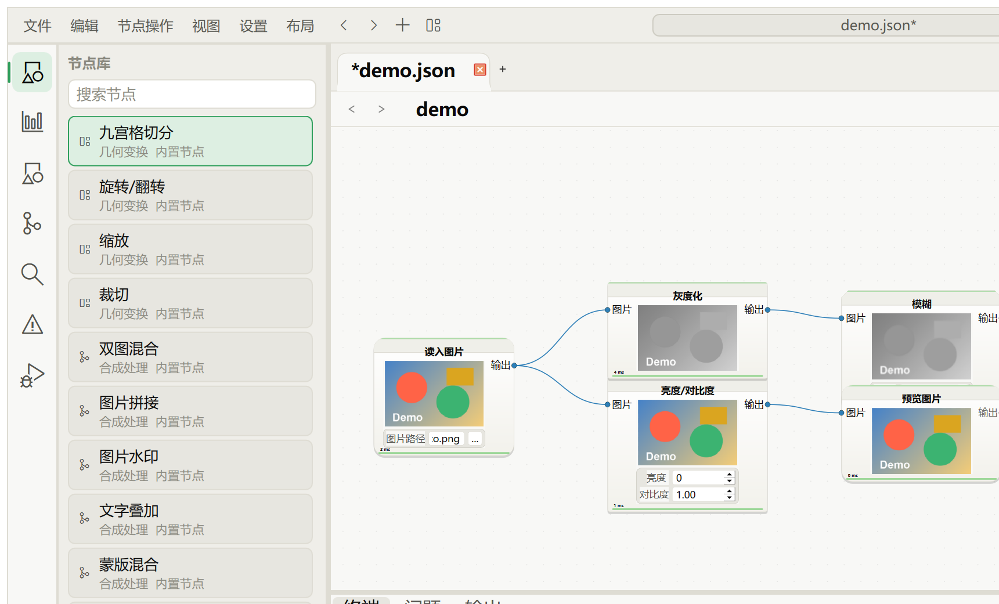

<div align="center">

# 🎨 ImageNodeEditor

**A node-based image-processing workflow tool built with Qt 6 + C++17**

Turn read / crop / color / filter / text-overlay / preview / export into visual **nodes**,<br/>wire them on a canvas, tweak parameters, run with one click, and save as JSON.


[简体中文](README.md) ｜ **English**



</div>

---

## Table of Contents

- [Introduction](#introduction)
- [Features](#features)
- [Screenshots](#screenshots)
- [Requirements](#requirements)
- [Build](#build)
- [Run](#run)
- [Interface Overview](#interface-overview)
- [User Guide](#user-guide)
  - [1. Adding & Managing Nodes](#1-adding--managing-nodes)
  - [2. Connecting Nodes](#2-connecting-nodes)
  - [3. Editing Parameters](#3-editing-parameters)
  - [4. Running a Workflow](#4-running-a-workflow)
  - [5. Canvas Navigation](#5-canvas-navigation)
  - [6. Undo & Redo](#6-undo--redo)
  - [7. Multiple Canvas Tabs](#7-multiple-canvas-tabs)
  - [8. Macro Nodes](#8-macro-nodes)
  - [9. Template Library](#9-template-library)
  - [10. History & Version Diff](#10-history--version-diff)
  - [11. Command Palette](#11-command-palette)
  - [12. Save, Open & Export](#12-save-open--export)
  - [13. Drag & Drop](#13-drag--drop)
  - [14. Theme & Appearance](#14-theme--appearance)
- [Settings](#settings)
- [Keyboard Shortcuts](#keyboard-shortcuts)
- [Node Reference](#node-reference)
- [Command Line (picdeal)](#command-line-picdeal)
- [Workflow JSON Format](#workflow-json-format)
- [Project Structure](#project-structure)
- [FAQ & Known Limitations](#faq--known-limitations)
- [Third-Party & License](#third-party--license)

---

## Introduction

ImageNodeEditor is a desktop **node-based image-processing workflow tool**. Each image operation is a "node" with input/output ports and adjustable parameters; wiring nodes together forms a processing pipeline (a workflow). A workflow can be run with one click, previewed live, and saved as JSON — or executed headless and in batch via the `picdeal` command line.

The GUI and the CLI share the same core (graph model, validation, execution engine, node factory), so behavior is identical.

## Features

- **Visual node canvas**: add / move / copy / delete nodes, drag ports to connect, delete edges, undo / redo, multiple canvas tabs.
- **27 built-in nodes + 1 macro node** across Input/Output, Geometry, Color, Filter, Compositing, and Batch (full list in the [Node Reference](#node-reference)).
- **Reliable execution engine**: validates port direction & type on connect, runs a DAG check and topological sort before execution, returns clear error messages instead of crashing; per-node caching avoids recomputation.
- **What-you-see-is-what-you-get**: each node shows its output thumbnail after a run; the preview pane supports fit-to-window, click-to-enlarge, and pixel color readout.
- **Workflow persistence**: save / load JSON recipes; supports relative and non-ASCII paths.
- **History & diff**: checkpoints, timeline, restore, branch, and a side-by-side visual comparison of two versions.
- **Productivity tools**: command palette, quick-add node, smart connect suggestions, template library, auto-layout, macro encapsulation.
- **`picdeal` CLI**: ffmpeg-style linear pipeline, folder batch processing, git-like save history.
- **Dark / light themes**, UI scaling, cross-platform (Windows / macOS / Linux).

## Screenshots

| Build a workflow (wires + parameters) | After running — output thumbnails |
| :---: | :---: |
|  |  |

---

## Requirements

| Dependency | Version / Notes |
| --- | --- |
| C++ compiler | C++17 (MSVC 2022/2026, Clang, or GCC) |
| Qt | **6.5+** (developed & verified on **6.8.3**); components `Core Gui Widgets Qml Quick QuickControls2 QuickWidgets`, plus `qtshadertools` on Windows |
| CMake | 3.16+ (for the cross-platform build) |
| Visual Studio | 2022 / 2026 (Windows only, for the VS project) |

> On Windows, install the Qt `msvc2022_64` kit via `aqtinstall` or the official installer; the default path used here is `C:\Qt\6.8.3\msvc2022_64`.

---

## Build

Two equivalent build paths — **pick one**; both compile the same source.

<details open>
<summary><b>Option 1 — Visual Studio (Windows, easiest)</b></summary>

1. Install Qt 6.8.3 `msvc2022_64` (default `C:\Qt\6.8.3\msvc2022_64`) and Visual Studio (with the "Desktop development with C++" workload).
2. Double-click **`ImageNodeEditor.slnx`** in the repo root.
3. Press **F5** (Release | x64) to build and run.

Output lands in `out/Release/`, with Qt runtime and QML modules already deployed by `windeployqt`.

> If Qt is installed elsewhere, set the `QTDIR` environment variable or edit `QtDir` in the `.vcxproj`.
> After editing a `Q_OBJECT` header or a `qml/` resource, run `ImageNodeEditor/GeneratedFiles/regen.bat` to refresh the pre-generated moc/rcc, then rebuild.

</details>

<details>
<summary><b>Option 2 — CMake (cross-platform)</b></summary>

**Windows**:

```bat
cmake -S . -B build-vs -G "Visual Studio 18 2026" -A x64 -DCMAKE_PREFIX_PATH=C:/Qt/6.8.3/msvc2022_64
cmake --build build-vs --config Release
```

**macOS**:

```bash
cmake -S . -B build -DCMAKE_PREFIX_PATH=$(brew --prefix qt)
cmake --build build -j
```

**Linux**:

```bash
cmake -S . -B build -DCMAKE_PREFIX_PATH=/path/to/Qt/6.8.3/gcc_64
cmake --build build -j
```

> The CMake path handles moc/rcc automatically (AUTOMOC/AUTORCC) and builds QtNodes from source — no manual regen needed.

</details>

---

## Run

```bash
# GUI
out\Release\ImageNodeEditor.exe            # Windows (VS build)
build-vs\Release\ImageNodeEditor.exe       # Windows (CMake build)
open build/ImageNodeEditor.app             # macOS

# Quick check with the sample workflow (headless)
out\Release\ImageNodeEditor.exe run ImageNodeEditor\resources\workflows\sample.json
```

---

## Interface Overview

The window is divided into several regions:

| Region | Description |
| --- | --- |
| **Title bar / menus** | Six menus on the left (File / Edit / Node Ops / View / Settings / Layout), back-forward, document title, and run / preview / panel / window buttons on the right. |
| **Activity bar** (left icon strip) | Switches the left sidebar: Node Library, Workflow Outline, Template Library, History, Search & Quick Access, Problems, Run Diagnostics; at the bottom: command palette, preview toggle, settings. |
| **Left sidebar** | Follows the activity bar; the most-used panel is the Node Library (searchable, drag to add nodes). |
| **Central canvas** | Main area for placing and wiring nodes; a tab strip and a macro-level breadcrumb sit on top. |
| **Right preview** | Shows the selected node's or the final output image; fit-to-window, click to enlarge. |
| **Bottom panel** | Terminal, Problems, Output/Log tabs. |
| **Status bar** | Ready / running state, current selection, zoom, etc. |
| **Minimap** | Thumbnail navigator at the bottom-left of the canvas (toggle in Settings). |

---

## User Guide

### 1. Adding & Managing Nodes

- **From the library**: search or browse in the left Node Library and **drag a node onto the canvas**.
- **Quick add**: press `Ctrl+K`, or `Tab` while over the canvas, to pop up a search box; type a node name / type / category and press Enter to create it at the cursor.
- **Move**: drag a node; on release it can snap to alignment guides or a grid (see [Settings](#settings)).
- **Copy / delete**: right-click a node for "Copy / Delete", or select and press `Delete` / `Backspace`. Copy includes the parameters.
- **Node card**: every node always shows its full set of parameters; after a run it also shows an output thumbnail.

### 2. Connecting Nodes

- Drag from a node's **output port** to another node's **input port** and release to connect.
- **Port rules**: outputs connect to inputs only; incompatible types can't connect (ports are colored by data type); a normal input accepts one edge while an output can branch to several downstream nodes; connections that would create a cycle are rejected.
- **Smart connect suggestions**: drop a dragged wire **on empty canvas** and the app filters type-compatible nodes, ordered "common processing first," and pops up a suggestion list; pick one and it's created and wired automatically (a single undo step).
- **Delete an edge**: click to select it and press `Delete`, or right-click the edge and delete.

### 3. Editing Parameters

- Edit parameters right on the node card: spin boxes for int/float, checkboxes for booleans, dropdowns for choices, line edits for text, and a "…" picker for file / directory / color.
- Editing a parameter triggers a **debounced live preview** — that node and its upstream recompute and the thumbnails/preview refresh.
- Ranges and defaults are listed in the [Node Reference](#node-reference), or run `picdeal nodes`.

### 4. Running a Workflow

- Click **Run** at the top (or search "Run" in the command palette, or use the button in the Run Diagnostics panel) to execute the whole pipeline.
- It **validates** first: ports, types, required inputs, parameter ranges, and that the graph is a DAG; failures are reported in the Problems panel and the offending node is focused.
- During a run, nodes show their **state** (running / succeeded / failed / cache hit) and elapsed time; a failed node is selected and centered automatically.
- A run can be **cancelled**: while running, the Run button becomes a cancel entry.
- **Per-node cache**: unchanged nodes reuse the previous result, so repeated runs of the same pipeline are faster.
- Results: the Preview node sends its output to the right pane; Output nodes write files; every node card shows its output thumbnail.

### 5. Canvas Navigation

- **Pan**: drag the empty canvas.
- **Zoom**: mouse wheel (low-speed steps, adjustable in Settings); range 25%–300%.
- **Auto-layout**: "Tidy Canvas" (menu / palette) arranges nodes by dependency level.
- **Fit to view**: right-click the canvas → "Reset view (fit all nodes)".
- **Snapping**: on release, nodes can snap to alignment guides with other nodes, or to a grid (toggle in Settings).
- **Minimap**: thumbnail navigator at the bottom-left (toggle in Settings).

### 6. Undo & Redo

Adding / copying / deleting nodes or edges, moving nodes, editing parameters, applying templates, restoring checkpoints, and more all go onto the undo stack; `Ctrl+Z` to undo, `Ctrl+Y` to redo. The window title marks unsaved changes.

### 7. Multiple Canvas Tabs

The tab strip above the canvas supports multiple canvases; click the trailing "+" to create a new one and switch between independent workflows.

### 8. Macro Nodes

**Encapsulate a group of nodes into one macro node** to keep complex pipelines tidy:

- Select some nodes → "Encapsulate as Macro" (menu / palette). The macro auto-derives its outer input/output ports from the internal "free ports" and can be wired like any node.
- **Enter / leave**: double-click a macro to edit its inner subgraph; use the **breadcrumb** above the canvas (Main › Macro A › …) to step back out.
- Editing the macro's interior updates its ports accordingly.

### 9. Template Library

The "Template Library" panel stores ready-to-apply workflow templates:

- **Save current as template** / **Import template** (from an external JSON).
- Each template can be **Applied / Renamed / Exported / Deleted** (preset templates are read-only — Apply / Export only).
- Applying a template overwrites the current canvas, but is undoable.

### 10. History & Version Diff

The "History" panel works like lightweight version control:

- **Timeline**: each save (`Ctrl+S`) is recorded automatically; "Restore" returns to that save.
- **Checkpoints**: "Save current progress" manually; each can be **Restored / Branched / Renamed / Exported / Deleted**; branching forks a new workflow from a checkpoint.
- **Compare**: "Compare…" opens the diff dialog — the top shows the **output thumbnails** of two versions (checkpoints or the current canvas) side by side; the bottom lists the **structural diff**: added / removed nodes, parameters changed old→new, and added / removed edges.

The GUI history and the CLI `picdeal save/log/restore` share the same storage and see each other.

### 11. Command Palette

Press `Ctrl+Shift+P` to open the command palette; type a keyword to search and run commands, jump to nodes, locate problems, or open recent workflows — the fastest entry point when you don't know the menus.

### 12. Save, Open & Export

- **New / Open / Save / Save As**: File menu or command palette. The saved file is the workflow JSON (no image binary).
- **Export workflow**: export a copy of the workflow.
- **Export preview result**: save the current preview image as PNG.
- **Export canvas screenshot** (`Ctrl+Shift+E`): render the whole canvas to an image.

### 13. Drag & Drop

- Drag an **image file** onto the canvas → an "Image Input" node is created automatically (multiple images cascade).
- Drag a **`.json` workflow** onto the canvas → it opens directly.

### 14. Theme & Appearance

**Dark / Light / Follow system** themes (dark by default) and overall UI scaling, both switchable in Settings and persisted.

---

## Settings

Open via "Settings → Open Settings". Organized into pages:

| Page | Item | Description |
| --- | --- | --- |
| **Appearance** | Theme | Dark / Light / Follow system |
| | UI size | Overall scaling of menus, sidebar, buttons, node parameter widgets, and text |
| **Canvas** | Current canvas zoom | Affects the central canvas only |
| | Wheel zoom speed | Zoom ratio per wheel notch (default 4%) |
| | Snap to alignment guides | Snap to align with other nodes on release (default on) |
| | Snap nodes to grid | Snap to a 20px grid on release (default off) |
| | Show output thumbnails on nodes | Show output images on nodes after a run (default on) |
| **Workbench** | Show right preview / bottom panel / minimap | Region visibility |
| | Reset layout | Restore sidebar, preview, and bottom panel to defaults |
| **Shortcuts** | Shortcut lookup | View current commands and shortcuts |

Settings are persisted (via `QSettings`) and restored on next launch.

---

## Keyboard Shortcuts

| Shortcut | Action |
| --- | --- |
| `Ctrl+K` / `Tab` over canvas | Quick-add node |
| `Ctrl+Shift+P` | Command palette |
| `Ctrl+Z` / `Ctrl+Y` | Undo / Redo |
| `Delete` / `Backspace` | Delete selected node(s) or edge |
| `Ctrl+=` / `Ctrl+-` / `Ctrl+0` | UI zoom in / out / reset |
| `Ctrl+Shift+E` | Export canvas screenshot |
| Mouse wheel | Canvas zoom |
| Drag empty area | Pan canvas |
| `Esc` | Close the command palette / popups |

> New / Open / Save / Run are available via the menus or command palette; use File → Save to save.

---

## Node Reference

**27 built-in nodes + 1 macro node.** Parameters are shown as "name (type) range"; run `picdeal nodes` for the full definitions.

### Input / Output

| Node | Description | Parameters |
| --- | --- | --- |
| Image Input `ImageInput` | Read an image from file, output RGBA | `filePath` input file |
| Image Output `ImageOutput` | Save an image to file | `outputPath` default `output.png` |
| Preview `Preview` | Pass through and send to the preview pane | none |

### Geometry

| Node | Description | Parameters |
| --- | --- | --- |
| Crop `Crop` | Crop a rectangle | `x/y` 0–100000, `width/height` 1–100000 (default 200) |
| Resize `Resize` | Resize the image | `width`(800)/`height`(600) 1–100000, `keepAspect` bool(true) |
| Rotate/Flip `RotateFlip` | Rotate or flip | `angle` [0/90/180/270], `flipHorizontal`/`flipVertical` bool |
| Grid Split `GridSplit` | Split into a grid, 9 fixed output ports | `rows`/`columns` 1–3 (default 3) |

### Color

| Node | Description | Parameters |
| --- | --- | --- |
| Grayscale `Grayscale` | Convert to grayscale | none |
| Brightness/Contrast `BrightnessContrast` | Adjust brightness & contrast | `brightness` -255–255, `contrast` 0–4(1.0) |
| Invert `Invert` | Invert colors | none |
| Threshold `Threshold` | Binarize by threshold | `level` 0–255(128) |
| Hue/Saturation `HueSaturation` | HSL adjust | `hue` -180–180, `saturation`/`lightness` -100–100 |
| Channel Split `ChannelSplit` | Split channels | none |
| Channel Merge `ChannelMerge` | Merge channels | none |

### Filter

| Node | Description | Parameters |
| --- | --- | --- |
| Blur `Blur` | Box blur (sliding window) | `radius` 0–20(3) |
| Sharpen `Sharpen` | Sharpen | `amount` 0–3(1.0), `radius` 1–10(2) |
| Edge Detect `EdgeDetect` | Edge detection | none |
| Pixelate `Pixelate` | Mosaic | `blockSize` 2–100(8) |

### Compositing

| Node | Description | Parameters |
| --- | --- | --- |
| Text Overlay `TextOverlay` | Draw text on the image | `text`, `anchor`, `x/y`, `size` 1–256(32), `color`, `fontFamily`, `bold`, `opacity` 0–1, `outline`, `outlineColor` |
| Blend `Blend` | Blend two images by mode | `opacity` 0–1(0.5), `mode`[normal/multiply/screen/overlay/darken/lighten/difference], `sizeMode`[stretch/fit/error] |
| Image Merge `ImageMerge` | Tile multiple images | `mode`[horizontal/vertical/grid], `columns` 1–9(2), `background` color |
| Mask Blend `MaskBlend` | Blend two images by a mask | none |
| Watermark `ImageOverlay` | Overlay a watermark image | `anchor`, `offsetX/offsetY`, `scale` 1–400(100), `opacity` 0–1(0.8) |

### Batch (ImageList data type — ports connect only to the same type)

| Node | Description | Parameters |
| --- | --- | --- |
| Folder Input `FolderInput` | Read a folder into an image list | `dirPath` dir, `maxCount` 1–64(16) |
| List Pick `ListPick` | Take the Nth image back to a single image | `index` 1–64(1) |
| List Merge `ListMerge` | Tile a list into one image | `mode`, `columns` 1–9(3), `background` |
| List Export `ListExport` | Save a list to a folder | `outputDir` dir, `baseName`(image), `format`[png/jpg] |

### Advanced

| Node | Description | Parameters |
| --- | --- | --- |
| Macro `Macro` | Encapsulate a group of nodes as a subgraph | `displayName` |

---

## Command Line (picdeal)

A convenient `picdeal` (`picdeal.exe` on Windows — the same binary as the app) is produced next to the build output.

```text
picdeal pipe   -i INPUT [--op [key=val|val]...] -o OUTPUT   # ffmpeg-style linear pipeline, runs it
picdeal batch  -d INPUT_DIR -o OUTPUT_DIR [--op ...] [--format png] [--max N]
                                                            # apply one pipeline to every image in a folder
picdeal build  -i ... [--op ...] --save workflow.json       # build and save a workflow (openable in the GUI)
picdeal run    workflow.json                                # run a saved workflow
picdeal validate workflow.json                              # validate only
picdeal nodes                                               # list all nodes and parameters
picdeal save   workflow.json [-m NOTE]                      # store into the save history (visible in GUI)
picdeal log    [--timeline]                                 # git-log-style list of the save history
picdeal restore <id> [-o out.json]                          # roll back to a saved revision
picdeal help | version
```

**`--op` operations (matching the GUI nodes)**: `grayscale`/`gray`, `blur [radius]`, `resize [WxH | width= height= keepAspect=]`, `crop [x= y= width= height=]`, `brightness`/`bc [val | brightness= contrast=]`, `rotate [angle | angle= flipHorizontal= flipVertical=]`, `text [text | text= x= y= size= color=]`, `preview`, `blend SECOND_IMG [opacity= mode=]`, `merge SECOND [THIRD] [mode= columns=]`, `sharpen [amount | amount= radius=]`, `edge`/`edgedetect`, `invert`, `threshold [level | level=]`, `hsl [hue | hue= saturation= lightness=]`, `pixelate [blockSize | blockSize=]`, `watermark MARK_IMG [anchor= offsetX= offsetY= scale= opacity=]`.

**Examples**:

```bash
picdeal pipe -i in.png --grayscale --blur 3 --resize 800x600 -o out.png
picdeal pipe -i a.png --blend b.png opacity=0.4 mode=multiply -o merged.png
picdeal batch -d photos -o out --grayscale --resize 1024x768 --format png
picdeal build -i in.png --brightness 20 contrast=1.2 --save flow.json
picdeal save flow.json -m "v1" && picdeal log
```

> Legacy entry point still works: `ImageNodeEditor.exe --no-gui --workflow path/to/workflow.json`.

---

## Workflow JSON Format

The file stores the "recipe" only — no image binary:

```json
{
  "formatVersion": 1,
  "nodes": [
    {"id": "ImageInput_1", "type": "ImageInput", "x": -240, "y": -60,
     "params": {"filePath": "../samples/input.ppm"}},
    {"id": "Grayscale_2", "type": "Grayscale", "x": 10, "y": -60, "params": {}},
    {"id": "ImageOutput_3", "type": "ImageOutput", "x": 260, "y": -60,
     "params": {"outputPath": "../samples/output.png"}}
  ],
  "edges": [
    {"fromNode": "ImageInput_1", "fromPort": "output", "toNode": "Grayscale_2", "toPort": "image"},
    {"fromNode": "Grayscale_2", "fromPort": "output", "toNode": "ImageOutput_3", "toPort": "image"}
  ]
}
```

- `formatVersion`: format version. `nodes`: each node's `id` / `type` / position / `params`. `edges`: `fromNode·fromPort → toNode·toPort`.
- Image paths are stored as relative paths when possible, resolved against the workflow file's directory on load; non-ASCII and spaced paths are supported.
- Node type names are listed by `picdeal nodes`; port names are stable (e.g. `image` / `output`).

---

## Project Structure

```text
ImageNodeEditor.slnx              VS solution (for submission, Windows)
CMakeLists.txt                    cross-platform build entry
ImageNodeEditor/
  main.cpp                        entry point: GUI vs. command-line dispatch
  app/                            picdeal subcommand dispatch
  core/                           basic types (port type, edge, parameter, result)
  nodes/                          ImageNode polymorphic base + NodeFactory + all nodes
  processing/                     pure image algorithms (crop/resize/color/filter/compose)
  workflow/                       graph, JSON serialization, validation, execution, save history
  gui/                            main window, canvas, parameter panel, preview, diff dialog
  qml/                            QML workbench shell (title bar / activity bar / sidebar)
  util/                           path utilities
  resources/                      sample images and workflows
third_party/                      QtNodes canvas library, Codicons icon font
docs/images/                      screenshots for README / report
```

UI, data model, image algorithms, and the execution engine are kept separate; the GUI and CLI both funnel into the same `workflow/` + `nodes/`. See [`struct.md`](struct.md) for detailed responsibilities and [`solution.md`](solution.md) for the overall design.

---

## FAQ & Known Limitations

- **Black sidebar**: usually a hand-copied run directory missing QML modules. Deploy with `windeployqt --qmldir`, or just use the build output directory.
- **CLI crashes on startup with `0xC0000409`**: missing the `qoffscreen` platform plugin. The build auto-deploys it; if copying by hand, include `platforms/qoffscreen.dll`.
- **Qt not found**: check that `CMAKE_PREFIX_PATH` / `QTDIR` points to the right Qt kit.
- **Missing symbols in VS after editing a `Q_OBJECT` header or qml**: run `ImageNodeEditor/GeneratedFiles/regen.bat` to refresh moc/rcc (the CMake path uses AUTOMOC and doesn't need this).
- The native VS project is configured for `Release | x64` only; to bound memory and time there are caps on very large images, oversized blur radius, etc.

## Third-Party & License

- [QtNodes](https://github.com/paceholder/nodeeditor): node canvas library, vendored under `third_party/QtNodes/`; see that directory for its license.
- [Codicons](https://github.com/microsoft/vscode-codicons): icon font (CC-BY-4.0), under `third_party/codicons/`.
- This project is coursework; its core features rely only on built-in Qt capabilities (`QImage` / `QPainter`, etc.) with no heavyweight dependencies such as OpenCV.
